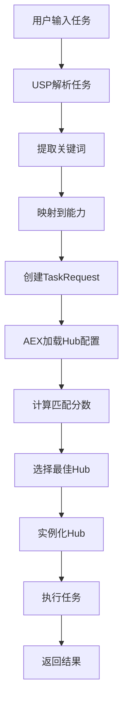

# AEX - 动态智能体市场 (Agent Exchange MVP)

基于《Agent Exchange》论文的核心思想，将AI智能体从被动执行的"工具"转变为能够参与市场化选择的"经济参与者"。

## 项目概述

AEX实现了一个完整的核心工作流：
1. 用户提交自然语言任务
2. 系统通过市场选择机制自动挑选最合适的智能体团队
3. 真实执行任务并返回结果

## 系统架构

### 核心组件

```
AEX/
├── main.py                 # 主程序入口
├── .env                   # 环境变量配置
├── hubs_config.json       # Hub配置文件
├── requirements.txt       # 依赖包
└── src/
    ├── usp.py            # 用户端平台 (User-Side Platform)
    ├── aex.py            # 代理交换平台 (Agent Exchange)
    ├── agent_hub.py      # Agent Hub基类
    └── hubs/
        ├── content_creation_hub.py  # 内容创作团队
        └── tech_analysis_hub.py     # 技术分析团队
```

### 1. USP (User-Side Platform) - 用户端平台
**文件**: `src/usp.py`

**功能**:
- 提供CLI输入接口
- 任务关键词提取和能力映射
- 创建TaskRequest对象

**核心类**:
- `UserSidePlatform`: 处理用户输入和任务解析
- `TaskRequest`: 任务请求数据结构

**智能能力映射**:
- **语义搜索**: 使用Jina嵌入模型进行语义理解
- **向量缓存**: 自动缓存嵌入向量，提高响应速度
- **关键词备用**: 语义搜索失败时自动回退到关键词匹配

**映射示例**:
```python
# 语义搜索示例
"帮我分析市场趋势" -> ["research", "analysis"] (相似度: 0.85)
"写一份技术报告" -> ["writing", "report", "technical"] (相似度: 0.92)

# 关键词映射示例
"调研" -> "research"
"写作" -> "writing"
"代码" -> "coding"
```

### 2. AEX (Agent Exchange) - 代理交换平台
**文件**: `src/aex.py`

**功能**:
- 加载和管理Hub配置
- 实现Hub选择算法
- 协调整个工作流程

**核心类**:
- `AgentExchange`: 核心控制器
- `HubInfo`: Hub信息数据结构

**选择算法**:
```python
# 计算匹配分数
base_score = 交集数量 / 所需能力数量
coverage_bonus = 交集数量 / Hub总能力数量 * 0.3
perfect_match_bonus = 0.2 (如果完全匹配)
final_score = base_score + coverage_bonus + perfect_match_bonus
```

### 3. Agent Hub - 智能体中心
**文件**: `src/agent_hub.py`, `src/hubs/`

**基类**: `BaseAgentHub`
- 定义Hub的抽象接口
- 提供通用的初始化和执行逻辑
- 处理错误和异常

**具体实现**:

#### ContentCreationHub (内容创作团队)
- **能力**: research, writing, summary, analysis, report
- **成员**: 研究员Agent + 作家Agent
- **模式**: coordinate (协调执行)
- **工具**: DuckDuckGoTools (网络搜索)

#### TechAnalysisHub (技术分析团队)  
- **能力**: coding, data_analysis, debugging, optimization, technical
- **成员**: 代码分析师Agent + 技术顾问Agent
- **模式**: collaborative (协作模式)

## 工作流程



## 配置文件

### .env 环境变量
```bash
# OpenRouter API配置
OPENAI_API_KEY=sk-or-v1-xxx  # OpenRouter API Key
OPENAI_BASE_URL=https://openrouter.ai/api/v1
OPENAI_MODEL=moonshotai/kimi-k2:free

# Jina嵌入API配置
JINA_API_KEY=jina_xxx  # Jina API Key

# AEX配置
USE_SEMANTIC_SEARCH=true  # 启用语义搜索
```

### hubs_config.json Hub配置
```json
[
  {
    "hub_id": "content_creation_hub",
    "name": "内容创作团队", 
    "description": "专注于信息研究和高质量内容撰写",
    "capabilities": ["research", "writing", "summary", "analysis", "report"],
    "hub_class": "ContentCreationHub"
  }
]
```

## 安装和运行

### 1. 安装依赖
```bash
pip install -r requirements.txt
```

### 2. 配置环境变量
复制并编辑 `.env` 文件，填入您的API密钥。

### 3. 运行系统Collaborate
```bash
python main.py
```

## 使用示例

### 内容创作任务
```
输入: "请帮我调研一下2025年AI Agent技术的发展趋势，并生成一份总结报告"
匹配: ContentCreationHub (research + writing)
执行: 研究员搜集信息 → 作家撰写报告
```

### 技术分析任务  
```
输入: "请分析这段Python代码的性能问题并提供优化建议"
匹配: TechAnalysisHub (coding + optimization)
执行: 代码分析师分析 → 技术顾问提供建议
```

## 扩展指南

### 添加新的Hub
1. 在 `src/hubs/` 创建新的Hub类
2. 继承 `BaseAgentHub`
3. 实现 `setup_team()` 和 `get_capabilities()` 方法
4. 在 `hubs_config.json` 中添加配置
5. 在 `aex.py` 中添加导入逻辑

### 添加新的能力映射
在 `usp.py` 的 `keyword_to_capability` 字典中添加新的关键词映射。

## 技术栈

- **Python 3.10+**
- **Agno**: AI智能体框架
- **OpenRouter**: LLM API服务
- **Rich**: 终端UI库
- **DuckDuckGo**: 网络搜索工具

## 项目特点

1. **模块化设计**: 清晰的组件分离，易于扩展
2. **智能语义搜索**: 使用Jina嵌入模型进行语义理解
3. **向量缓存**: 自动缓存嵌入向量，提高响应速度
4. **动态Hub发现**: 自动扫描和加载新的Agent Hub
5. **动态选择**: 基于能力匹配的智能Hub选择
6. **真实执行**: 集成Agno框架，真实执行任务
7. **用户友好**: Rich库提供美观的CLI界面
8. **可配置**: JSON配置文件，易于管理Hub

## 未来规划

- [ ] 添加更多专业化的Hub
- [ ] 实现更复杂的选择算法
- [ ] 添加任务历史和学习机制
- [ ] 支持异步任务执行
- [ ] 添加Web界面
